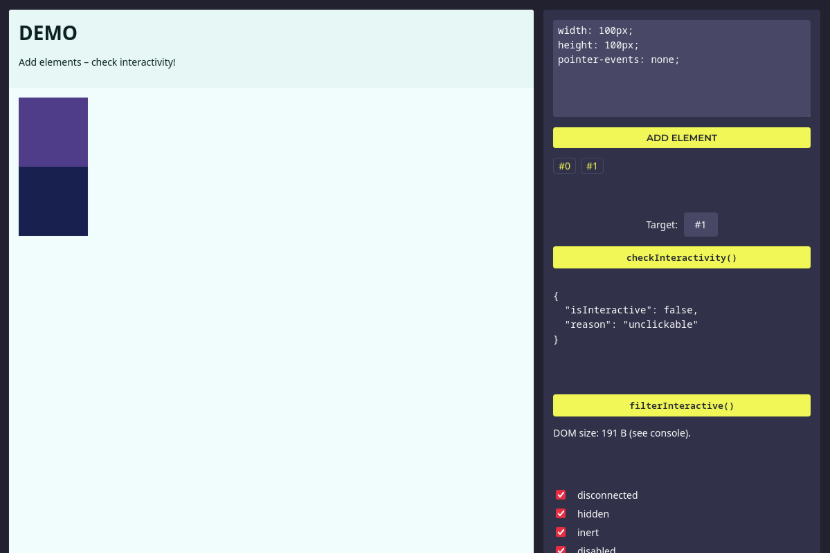

# Is Interactive?

Versatile DOM element interactivity checks.

``` console
npm install webfuse-com/is-interactive
```

### Example

``` js
import { checkInteractivity, filterInteractive } from "@webfuse-com/is-interactive";

// Check if an element is interactive:
const click = targetElement => {
  const { isInteractive } = checkInteractivity(targetElement, {
    invisible: false  // disables invisible check
  });

  if(!isInteractive) return;

  automation.click(button);
};

// Create a DOM snapshot (weakly corresponding to the GUI):
const surfaceDOMSnapshot = selector => {
  return filterInteractive(document, {
    offViewport: true
  }).outerHTML;
};
```

### API

``` ts
// Toggle checks to perform (default: all enabled, except 'offViewport')
interface InteractivityChecks {
  clipped: boolean;       // true
  collapsed: boolean;     // true
  disabled: boolean;      // true
  disconnected: boolean;  // true
  hidden: boolean;        // true
  inert: boolean;         // true
  invisible: boolean;     // true
  modalBlocked: boolean;  // true
  occluded: boolean;      // true
  unclickable: boolean;   // true
  ariaHidden: boolean;    // false
  offScrolled: boolean;   // false
  offViewport: boolean;   // false
}

/**
 * Check whether an element is interactive.
 */
function checkInteractivity(element: Element, checks?: InteractivityChecks): {
  isInteractive: boolean;
  reason?:
    | "notElement"
    | "clipped"
    | "collapsed"
    | "disabled"
    | "disconnected"
    | "hidden"
    | "inert"
    | "invisible"
    | "modalBlocked"
    | "occluded"
    | "unclickable"
    | "ariaHidden"
    | "offScrolled"
    | "offViewport"
}

/**
 * Filter a DOM (sub)tree for interactive elements.
 * Create a 'surface'-only DOM.
 */
function filterInteractive(dom: Document | Element, checks?: InteractivityChecks): Element
```

### DEMO

Open [demo/demo.html](./demo/demo.html) in a browser.

<a href="./demo/demo.html">
  
</a>